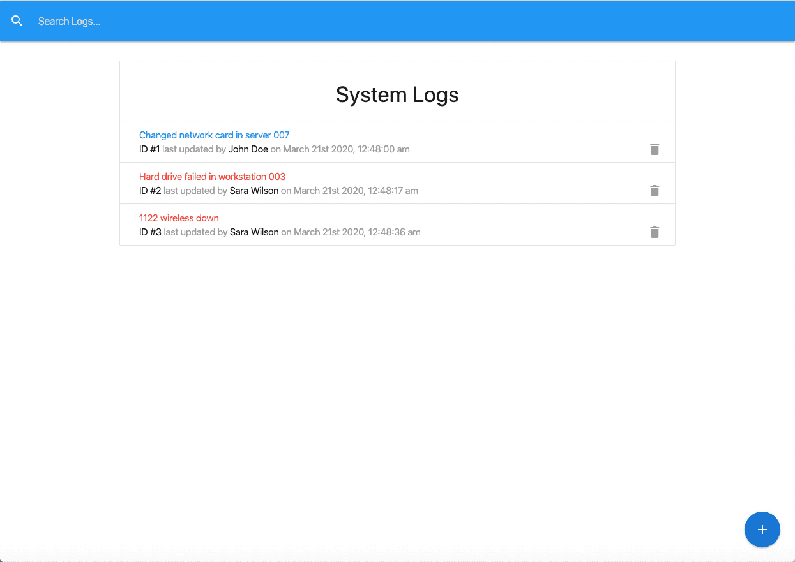

**Project Name:** [IT Logger](https://github.com/craigbooker/it-logger)

**Description:**
A ReactJS app which allows users to log it needs and a place to log when they are completed.

**Tech Details:**
This is utilizing Javascript, React, web hooks such as useContext, useReducer to manage the context. The repo is published on Github.

[Click or tap here to check out the IT Logger repository on Github!](https://github.com/craigbooker/it-logger)